# training360-szoftverarchitekturak
SzoftverArchitekturak Gyakorlatok
# Konzolos alkalmazás

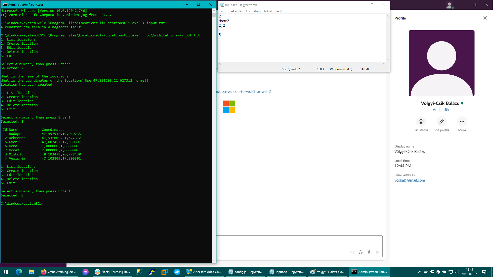

# Grafikus alkalmazás
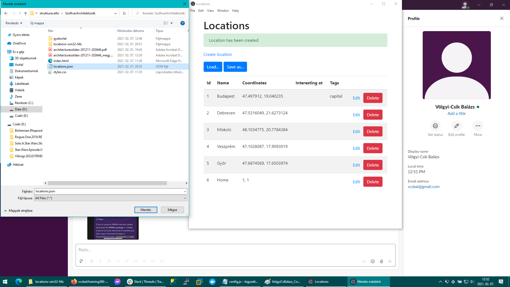
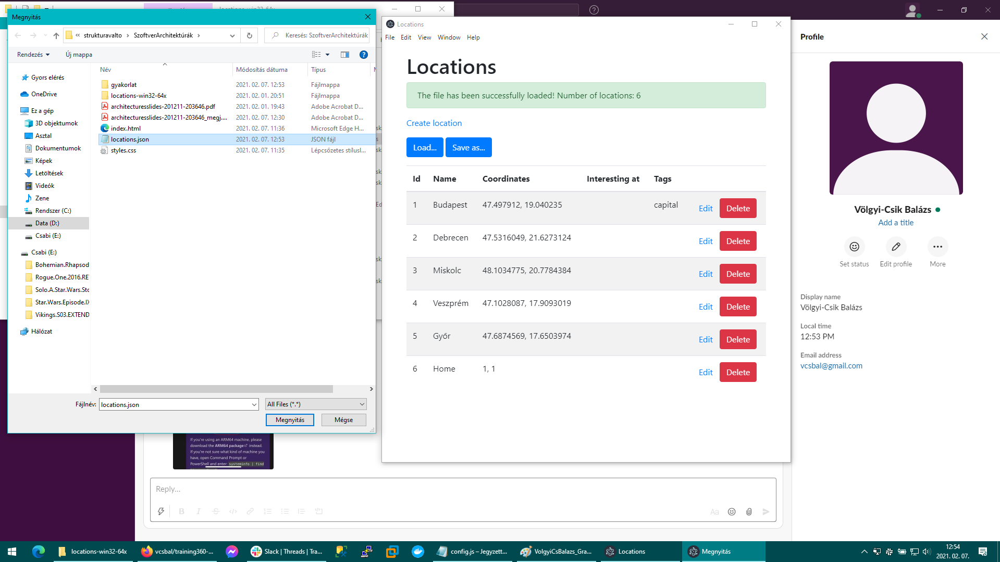
# Maria DB - DBeaver
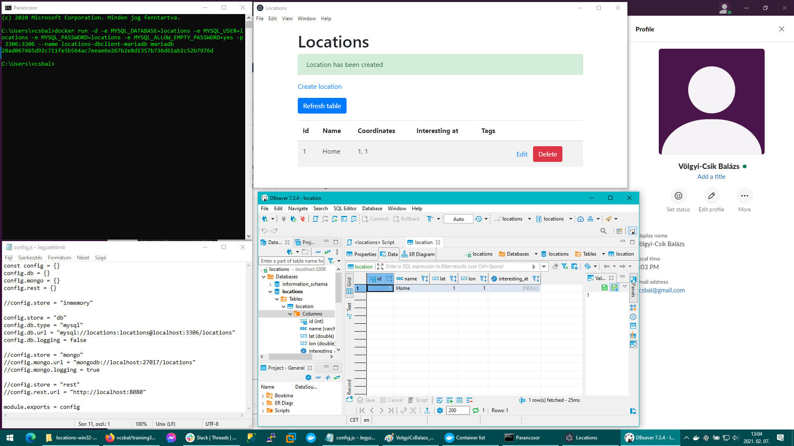
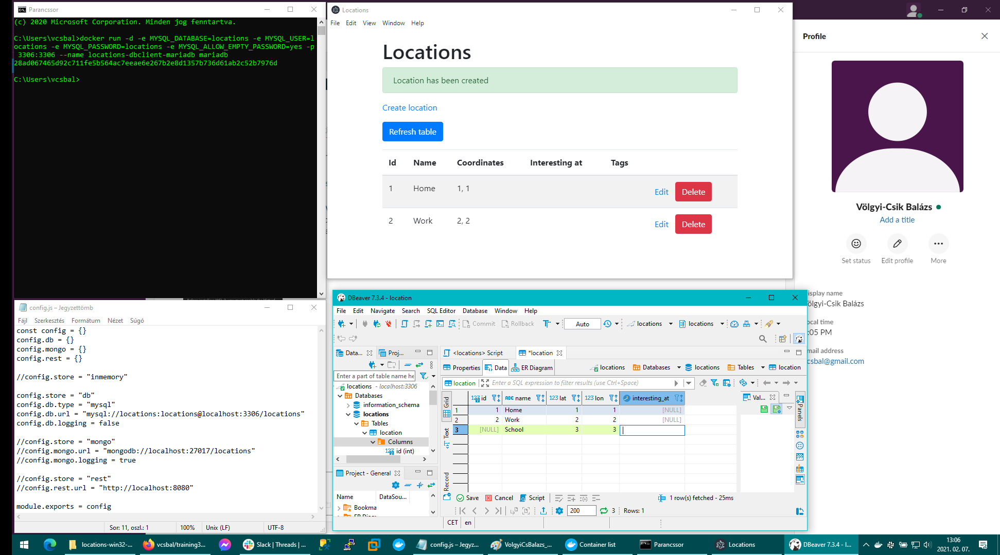
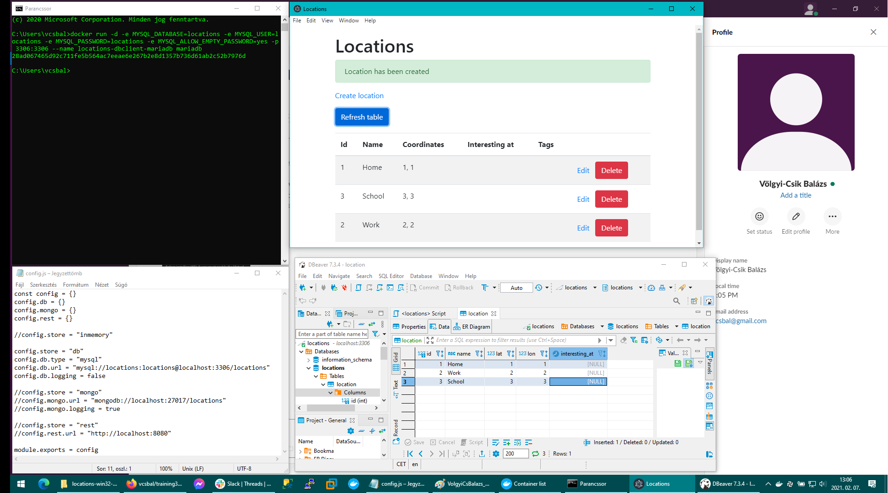
# Maria DB - Console
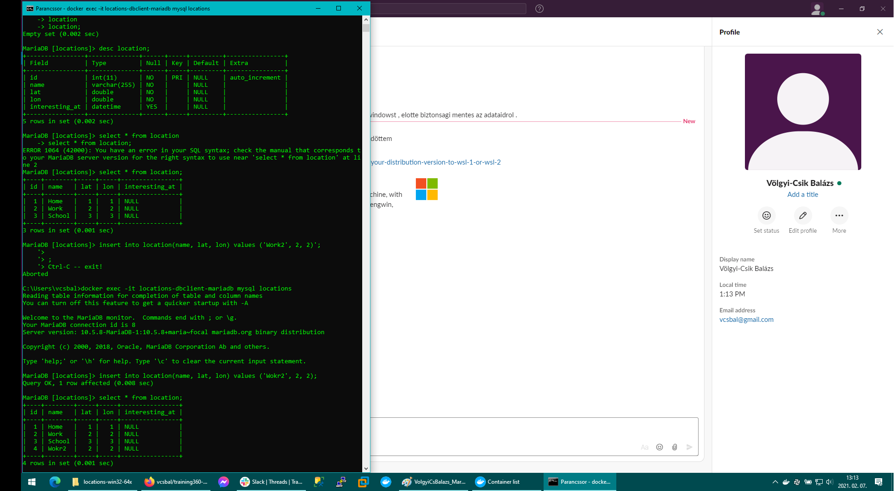
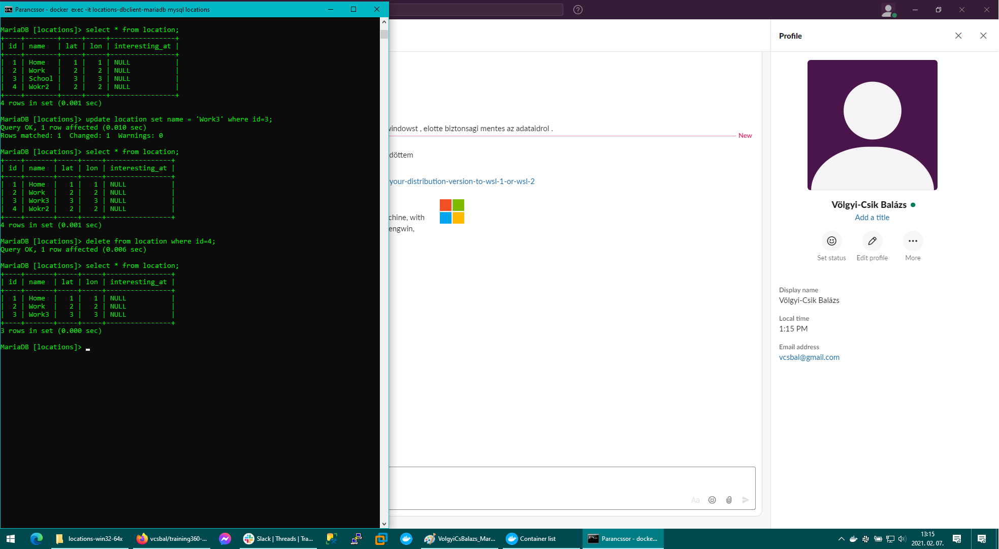
# Maria DB - DBeaver - script
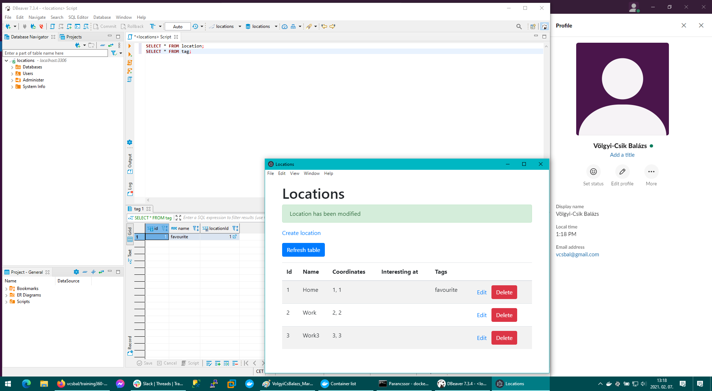
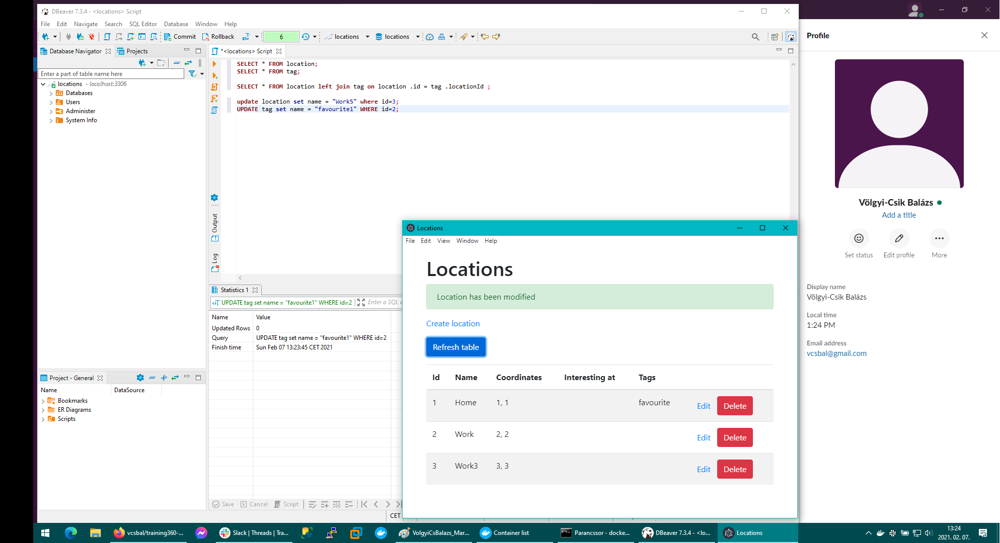
# Mongo DB - NOSQL
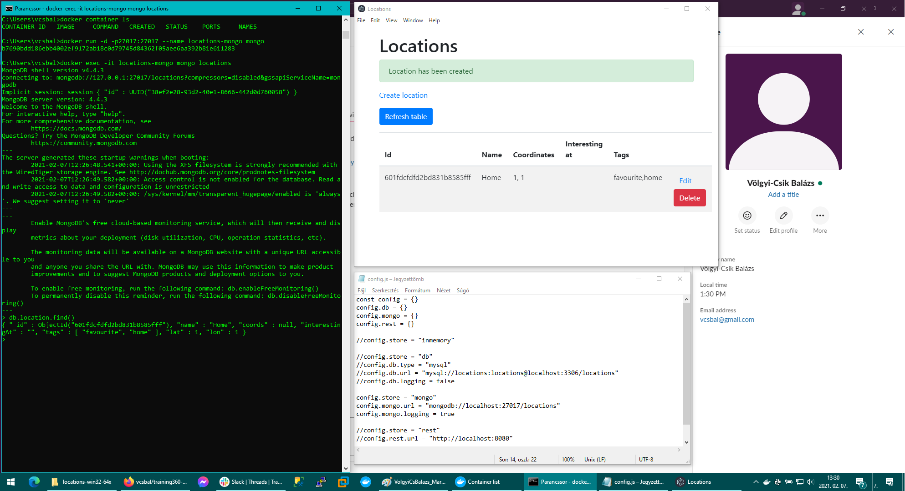
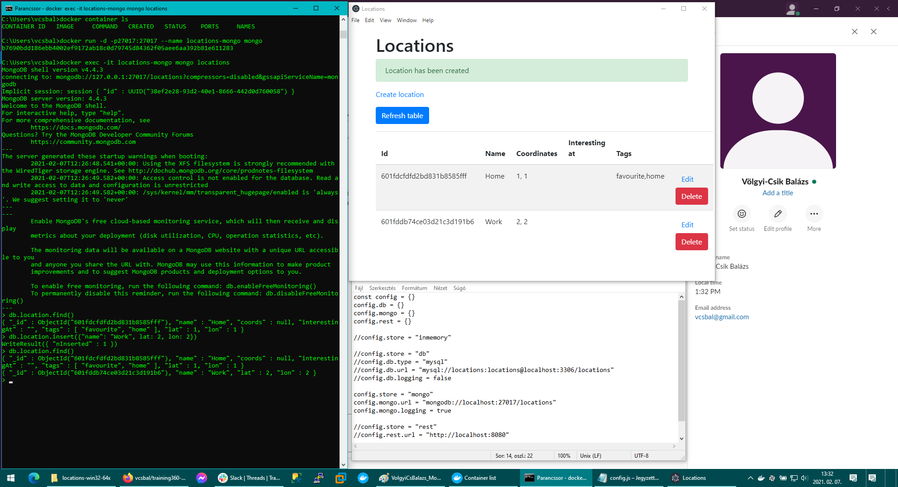
# Többrétegű alkalmazás
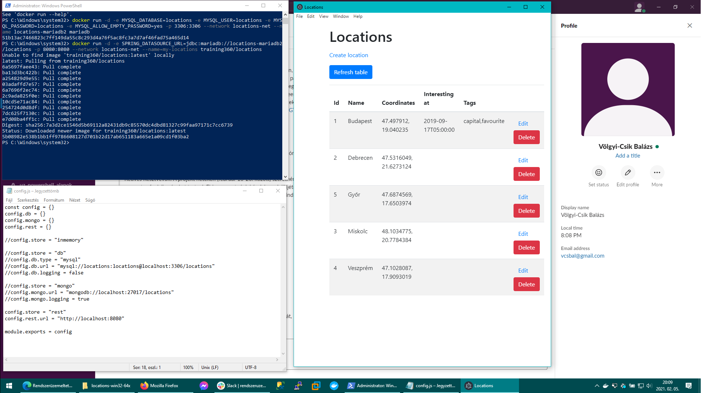
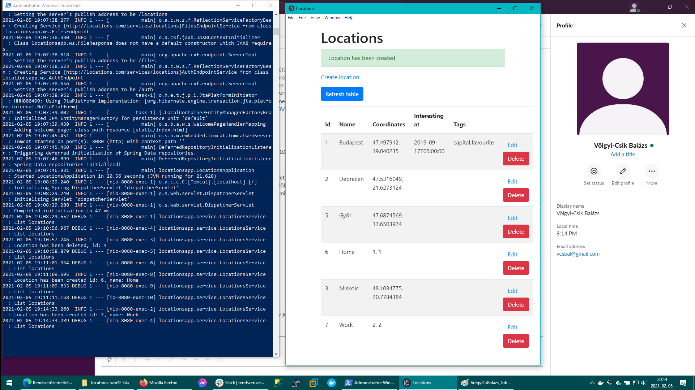
# Web alkalmazás
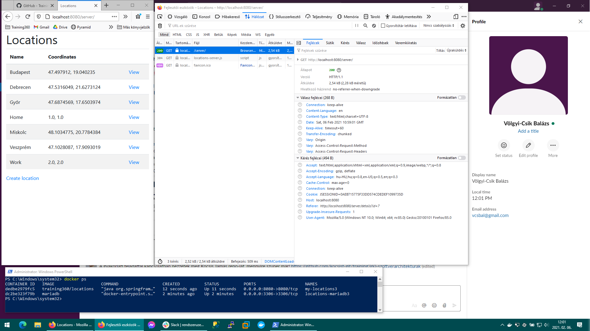
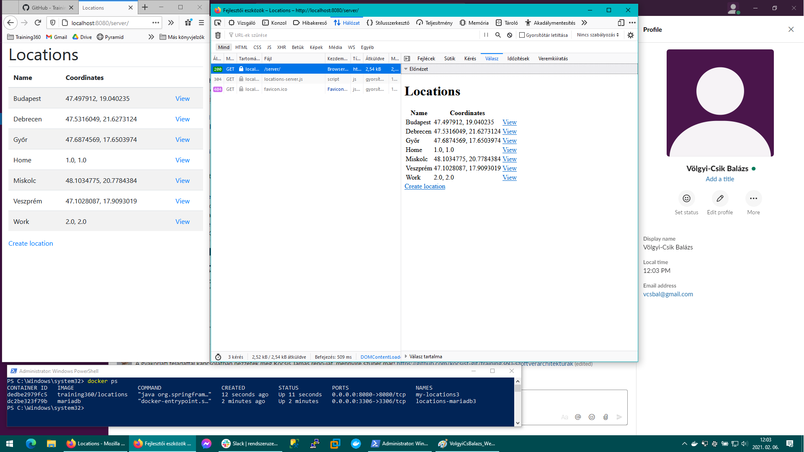
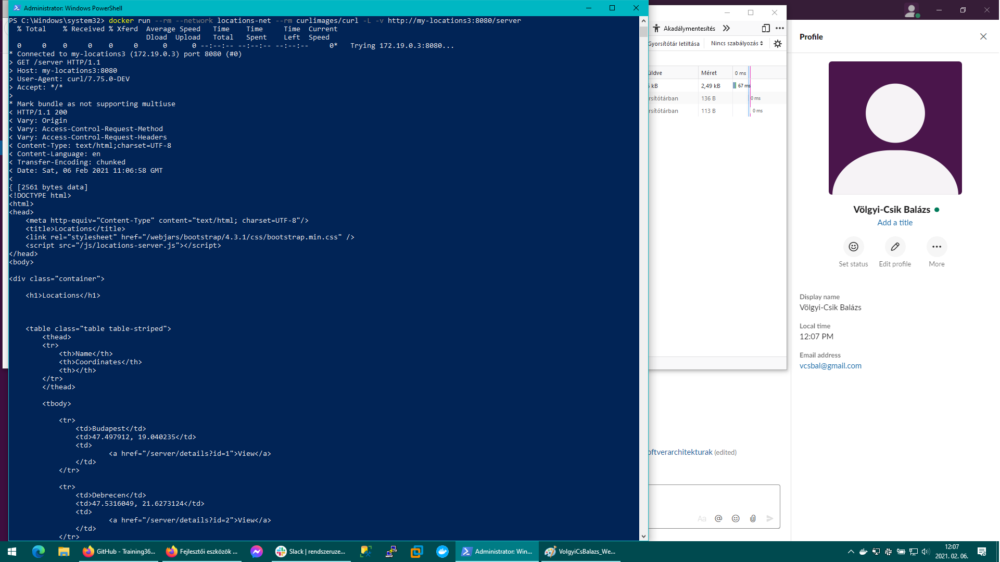
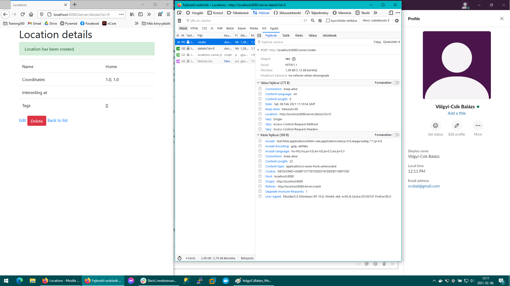
