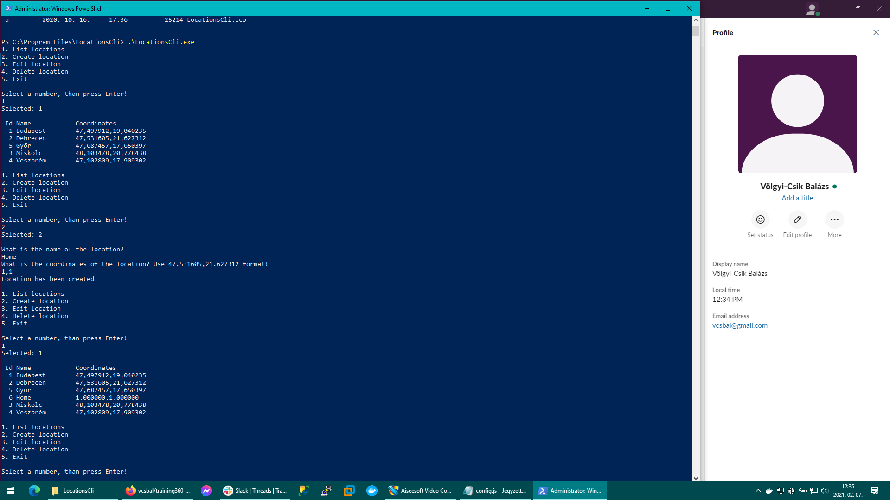
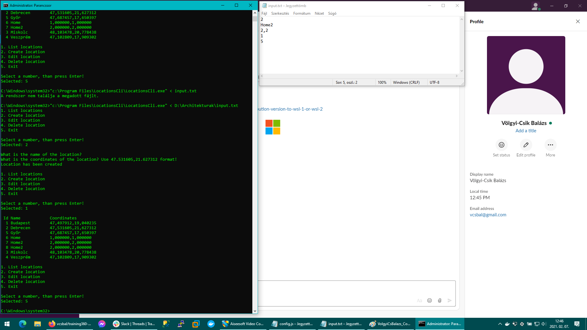

# training360-szoftverarchitekturak
SzoftverArchitekturak Gyakorlatok
# Konzolos alkalmazás

# Grafikus alkalmazás

# Maria DB - DBeaver

# Maria DB - Console

# Maria DB - DBeaver - script

# Mongo DB - NOSQL

# Többrétegű alkalmazás

# Web alkalmazás

# HTML

# CSS

# RIA JavaScript

# RIA Web

# RIA Swagger

# RIA Postman

# SoapUI

# Magas rendelkezésre állás

# Virtualizáció

